# Monitoring & Alerting with Prometheus and Grafana

This project automates monitoring and alerting using Prometheus, Node Exporter, Grafana, and AlertManager. It provides real-time system metrics and sends notifications when thresholds are exceeded.

1. Installing Prometheus
Download & Extract Prometheus
wget https://github.com/prometheus/prometheus/releases/download/v2.52.0/prometheus-2.52.0.linux-amd64.tar.gz
tar xvf prometheus-2.52.0.linux-amd64.tar.gz
cd prometheus-2.52.0.linux-amd64

Start Prometheus
./prometheus


Access Prometheus UI: http://localhost:9090

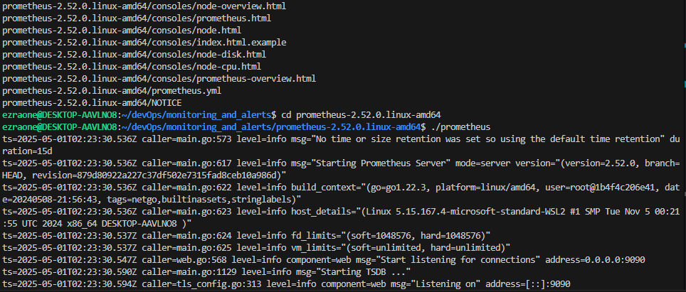

2. Installing Node Exporter
Download & Extract Node Exporter
wget https://github.com/prometheus/node_exporter/releases/download/v1.8.1/node_exporter-1.8.1.linux-amd64.tar.gz
tar xvf node_exporter-1.8.1.linux-amd64.tar.gz
cd node_exporter-1.8.1.linux-amd64

Start Node Exporter
./node_exporter

Access Metrics: http://localhost:9100/metrics

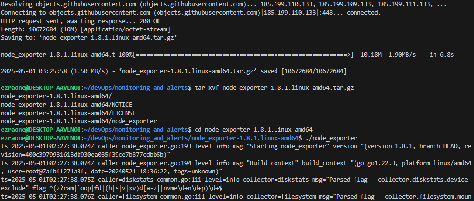

3. Configure Prometheus to Scrape Node Exporter
Edit prometheus.yml in the Prometheus directory and add the following under scrape_configs:
scrape_configs:
  - job_name: 'node_exporter'
    static_configs:
      - targets: ['localhost:9100']

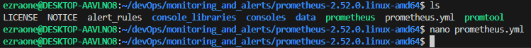

Restart Prometheus to apply changes:
sudo systemctl restart prometheus

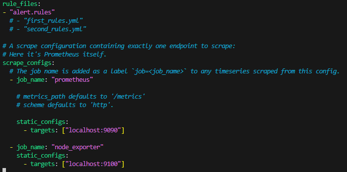

4. Installing Grafana
Installation (Debian/Ubuntu)
sudo apt-get install -y apt-transport-https software-properties-common wget
wget -q -O - https://apt.grafana.com/gpg.key | sudo gpg --dearmor | sudo tee /etc/apt/keyrings/grafana.gpg > /dev/null
echo "deb [signed-by=/etc/apt/keyrings/grafana.gpg] https://apt.grafana.com stable main" | sudo tee -a /etc/apt/sources.list.d/grafana.list
sudo apt-get update && sudo apt-get install grafana

Alternative (Ubuntu Manual Install)
wget https://dl.grafana.com/oss/release/grafana_10.0.3_amd64.deb
sudo dpkg -i grafana_10.0.3_amd64.deb
sudo apt --fix-broken install

Start Grafana
sudo systemctl start grafana-server
sudo systemctl enable grafana-server

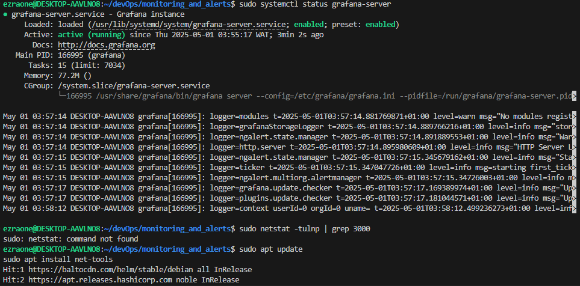

Access Grafana UI: http://localhost:3000 (Default login: admin/admin)


#### Adding Prometheus as a Data Source in Grafana
- Go to Data Sources → Click Add Data Source → Select Prometheus
- Set the URL to: http://localhost:9090
- Click Save & Test → Ensure data source is working


#### Visualizing Metrics in Grafana
Option 1: Import a Prebuilt Dashboard
- Click the + icon → Import Dashboard
- Enter Node Exporter Dashboard ID: 1860
- Assign Prometheus as the data source → Click Import

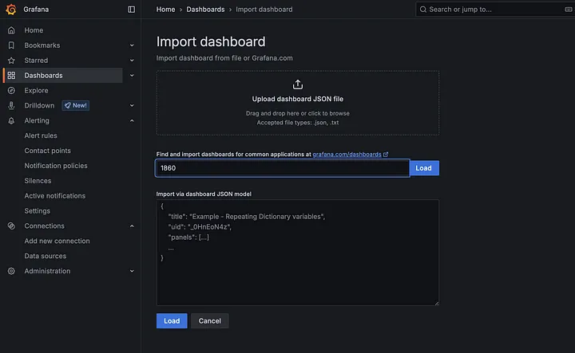

Option 2: Create a Custom Dashboard
- Click Dashboard → Add New Panel
- Select Prometheus as the data source
- In the Query Box, type:up

- Click Apply → Save the dashboard

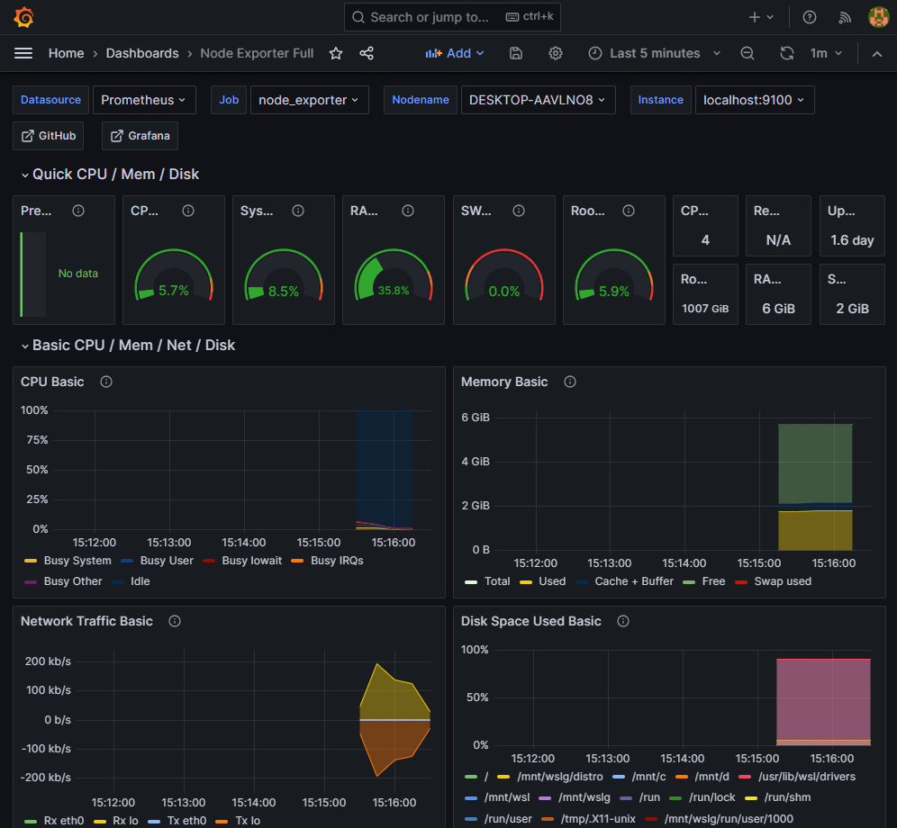

#### Setting Up Alerting with AlertManager
Download & Extract AlertManager
wget https://github.com/prometheus/alertmanager/releases/download/v0.27.0/alertmanager-0.27.0.linux-amd64.tar.gz
tar xvf alertmanager-0.27.0.linux-amd64.tar.gz
cd alertmanager-0.27.0.linux-amd64

Start AlertManager
./alertmanager

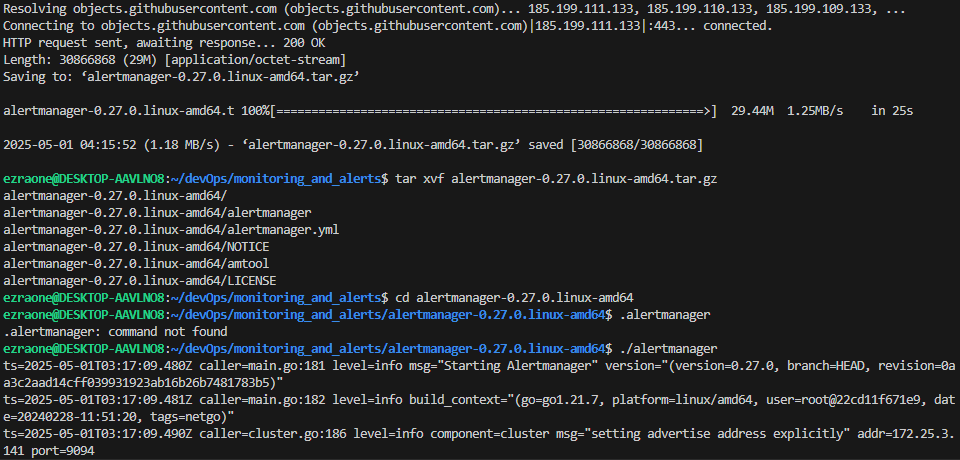

Access AlertManager: http://localhost:9093

#### Configuring Prometheus Alerting Rules
Modify `prometheus.yml` to Reference AlertManager
Add this under alerting:
````sh
alerting:
  alertmanagers:
    - static_configs:
        - targets: ['localhost:9093']
````

Reference alert.rules in prometheus.yml
rule_files:

  - "alert.rules"'

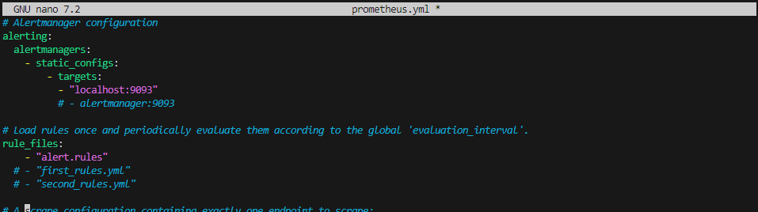

Define Alerting Rules
Create `alert.rules` file and add:

````sh
groups:
  - name: cpu_alerts
    rules:
      - alert: HighCPUUsage
        expr: instance:cpu_usage:rate5m > 80
        for: 1m
        labels:
          severity: critical
        annotations:
          summary: "High CPU usage detected"
          description: "CPU usage exceeded 80% for 1 minute."
````

Alternatively,

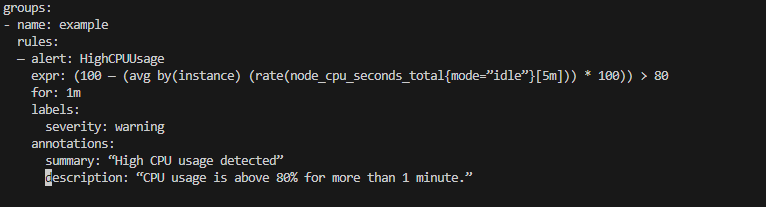

#### Configuring Email Alerts in AlertManager
Create `alertmanager.yml` 

```sh
global:
  resolve_timeout: 5m

route:
  receiver: "email-alert"
  group_wait: 10s
  group_interval: 30s
  repeat_interval: 5m

receivers:
  - name: "email-alert"
    email_configs:
      - to: "your-email@example.com"
        from: "alertmanager@example.com"
        smarthost: "smtp.example.com:587"
        auth_username: "your-email@example.com"
        auth_password: "your-email-password"
```

Alternatively,

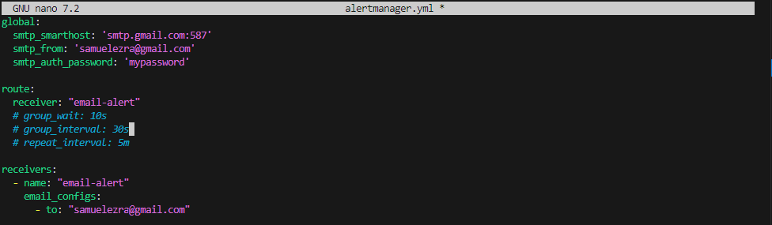

#### Summary of the Monitoring & Alerting Setup
✔ Prometheus collects system metrics

✔ Node Exporter exposes system performance data

✔ Grafana visualizes metrics

✔ AlertManager sends email alerts when conditions are met
